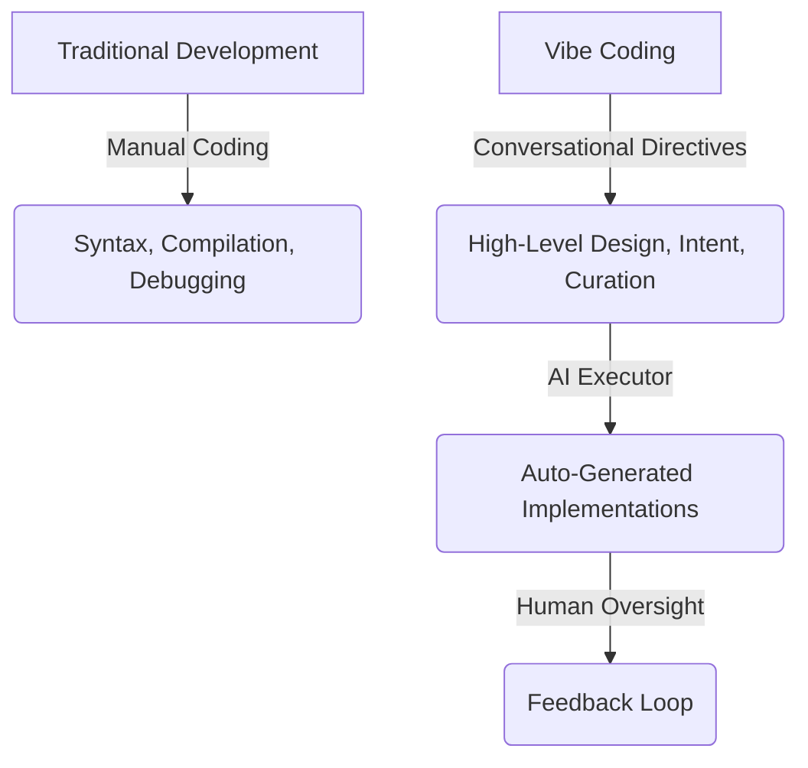
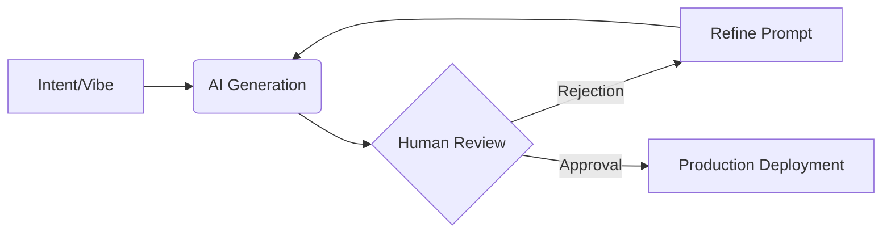
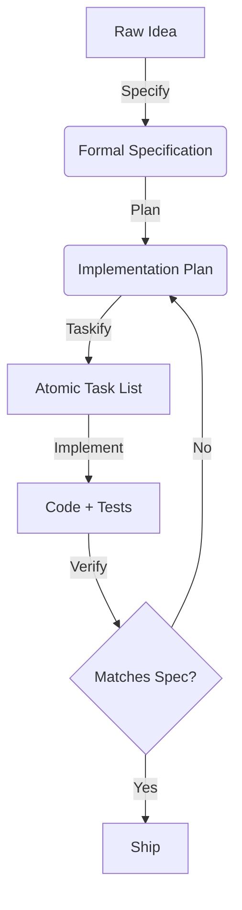

# Web Application Development with "Vibe Coding"

"Vibe Coding" is a modern paradigm shift in software engineering and web application development. Coined in early 2025, the term captures a conversational, prompt-driven approach to creating software where humans direct high-level ideas, and AI executes the line-by-line implementation.

---

## 🚀 1. What is "Vibe Coding"?

**Vibe Coding** represents a software development workflow where the developer shifts from being a line-by-line coder to a creative director or software architect.

Instead of writing code manually, the developer:

1. Describes the intended system, features, or design in **natural language**.
2. Guides autonomous AI agents or code assistants to generate the files, scripts, and structures.
3. Tests, refines, and iterates in a loop of feedback and adjustment.

As AI researcher and OpenAI co-founder **[Andrej Karpathy](https://x.com/karpathy/status/1886192184808149383)** put it:

> *"Fully give in to the vibes, embrace exponentials, and forget that the code even exists."*

### The Conceptual Shift

---

## 🛠️ 2. Core Principles & Workflow

Vibe coding is not just about typing a single prompt; it is an iterative, conversational dialogue with AI. The standard lifecycle of a web application built via vibe coding follows this loop:

### 1. Conceptualization & Architectural Prompting

The developer establishes the stack, visual guidelines, and functional requirements. Instead of asking for code immediately, they prompt the AI to plan the application.

### 2. Iterative Generation ("See Stuff, Say Stuff, Run Stuff")

* **See Stuff:** Run the code and visually or programmatically inspect the output.
* **Say Stuff:** Tell the AI what is broken, what to change, or what feature to add next.
* **Run Stuff:** Execute the newly refactored or expanded codebase.

### 3. The "Tech Lead" Mindset

In vibe coding, the human takes on the role of a **Tech Lead** or **Product Manager**, and the AI acts as a highly capable but literal **Junior Engineer**.

---

## 🧰 3. The 2026 Vibe Coding Ecosystem

By 2026, the ecosystem has moved beyond simple "chat-and-code" to **Context-Aware Orchestration**.

| Platform | Category | 2026 Capabilities | Examples |
| :--- | :--- | :--- | :--- |
| **Agentic IDEs** | Local Orchestration | Autonomous multi-file refactoring, deep codebase indexing, local agent execution. | Cursor, Windsurf |
| **Agy & Orchestration** | The Brain | Intent, state, and cross-file planning. Compiles natural language "vibes" into SDD. | Agy, Genkit, Vercel AI SDK |
| **Frontend/App Generators** | UI/UX Prototyping | Fast scaffolding of complex UI components and full application skeletons. | Bolt.new, v0.dev, Replit Agent |
| **Autonomous Coding Agents** | Atomic Execution | Specialized agents for executing complex, multi-step tasks with verification. | Devin, OpenDevin |
| **Autonomous Cloud Agents** | Execution & Infra | Instant scaffolding of backends, CI/CD pipelines, and serverless infrastructure. | Firebase App Hosting, Vercel |

---

## 🛠️ 4. Tool Categorization & Usage

Understanding the role of each tool is critical for effective vibe coding.

### Agentic IDEs

These tools serve as the core workspace. They offer deep integration with your local file system, providing context-aware suggestions and the ability to apply changes across multiple files automatically.

### Frontend/App Generators

Ideal for rapid prototyping. They excel at turning high-level design descriptions into functional UI components or entire application skeletons in seconds.

### Orchestration Platforms

The "brain" of the operation. These platforms help manage intent and state over time, breaking down high-level prompts into structured specifications.

### Autonomous Coding Agents

Tools designed to perform complex, multi-step tasks (e.g., bug fixing, library integration) with minimal human intervention, relying on automated testing to ensure correctness.

### Autonomous Cloud Agents

These tools streamline the "last mile" of deployment, bridging the gap between a functional prototype and a production-grade application by automatically configuring infrastructure.

---

## ⚖️ 4. Pros & Cons of the "Vibe" Approach

While vibe coding has made app creation incredibly fast, it is a subject of active debate in the software development community.

### Advantages

* ⚡ **Extreme Velocity:** Build functional prototypes, MVPs (Minimum Viable Products), and internal utilities in minutes or hours instead of days or weeks.
* 🔓 **Democratization of Software:** Lowers the entry barrier, allowing designers, product managers, and non-programmers to build real web applications.
* 🧠 **Reduced Cognitive Load:** Automates repetitive boilerplates, configuration steps, and environment setups, allowing developers to focus purely on product and UX design.

### Risks and Challenges

* ⚠️ **Code Quality & Technical Debt:** AI-generated code can sometimes be a "black box," containing redundant functions, inefficient algorithms, or outdated paradigms.
* 🔒 **Security Vulnerabilities:** LLMs can easily introduce insecure dependencies, ignore input validation, or leak sensitive API secrets if not guided carefully.
* 📉 **Skill Atrophy:** Relying purely on AI can weaken a developer's foundational understanding of language syntax, algorithms, and fundamental computer science principles over time.

---

## 📚 5. Best Practices for High-Quality Vibe Coding

To transition from "pure" hobbyist vibe coding to **production-grade AI-assisted software engineering**, developers should follow these practices:

### 1. Master Context and Scope

* **Ground the AI:** Provide precise files, database schemas, and documentation. Don't let the AI guess or hallucinate.
* **Break It Down:** Never ask for a complete website in one prompt. Split development into incremental, micro-features (e.g., first build the database schema, then user authentication, then the dashboard UI).

### 2. Prioritize Verification and Testing

* **Test Immediately:** Build unit tests or functional tests early. Use the AI to generate tests to verify its own logic.
* **Review Generated Code:** Never blindly accept large code generation. Do diff reviews and inspect the architectural patterns.

### 3. Maintain Secret and Environment Security

* Never paste API keys, private tokens, or user data into prompts.
* Always enforce the use of `.env` files and ensure they are added to `.gitignore`.

### 4. Inject Your "Taste" and Design Aesthetics

* While AI can write functional logic, human "taste" dictates whether an app is delightful to use. Pay special attention to modern typography, subtle micro-animations, curated color palettes, and responsive design.

---

## ⚖️ 6. Vibe Coding vs. Low-Code/No-Code: The New Divide

While both aim to democratize development, Vibe Coding and Low-Code/No-Code (LCNC) represent fundamentally different philosophies.

| Feature | Vibe Coding | Low-Code / No-Code |
| :--- | :--- | :--- |
| **Primary Interface** | Natural language (Chat/Prompts) | Visual (Drag-and-drop, Menus) |
| **Output** | **Real Source Code** (React, Python, etc.) | **Proprietary Metadata** (Platform-locked) |
| **Flexibility** | **Infinite.** Anything code can do. | **Limited** to pre-built components. |
| **Vendor Lock-in** | **Low.** You own and host the code anywhere. | **High.** Moving off requires a total rebuild. |
| **Governance** | **Manual Review.** Requires human oversight. | **Built-in.** Enterprise-grade security. |

---

## 🎨 7. The Human Element: "Taste" is the New Compiler

In the era of vibe coding, the developer’s primary role shifts from **Implementation** (writing syntax) to **Curation** (evaluating output). As AI handles the "how," human taste becomes the primary "what."

### Taste as the "Last Mile" Solution

AI is excellent at generating the first 80-90% of a functional prototype. However, human taste is required for the final 10%—the precise spacing, the "soul" of the brand, and the intuitive micro-interactions that make a product feel premium.

---

## 📈 8. The Future of the Software Job Market

Vibe coding is reshaping the developer career trajectory, creating a "hollowing out" of the middle and a radical shift in seniority.

* **The "Junior Squeeze":** Entry-level roles that focused on boilerplate and unit tests are being disrupted, as AI handles these tasks instantly.
* **The "Seniority Premium":** The value of senior engineers has shifted from *syntactic fluency* to **architectural judgment**. Seniors are now "AI Operators" who ensure security, scalability, and system integrity.

### The Shift in Primary Skills

| Skill Type | Traditional Era | Vibe Coding Era |
| :--- | :--- | :--- |
| **Primary Skill** | Syntax & Language Mastery | System Design & Intent Definition |
| **Development Role** | Lead Implementer | Architectural Director / AI Operator |
| **Key Risk** | Slow time-to-market | High technical debt / "Slop" |

---

## 🛡️ 9. Managing "Vibe Debt" and Technical Slop

The greatest risk of rapid AI generation is **Vibe Debt**—the accumulation of unreviewed, redundant, or insecure code that becomes a "black box" over time.

### Strategies for Production-Grade Quality

1. **Avoid the "Slop" Factor:** Never accept large code generations without a diff review. Treat AI output as a "pull request" from a junior intern.
2. **The Rise of "Cleanup Engineers":** A new category of developer focused on refactoring and securing "vibe-coded" prototypes into scalable systems.
3. **Micro-Verification:** Use the AI to generate unit tests *before* it generates the implementation to ensure functional correctness from the start.
4. **Stay "Code-Literate":** While you may not write every line, you must remain capable of reading and understanding the code to debug the edge cases AI misses.

---

## 🛠️ 10. Spec-Driven Development (SDD): Beyond the Vibe

As vibe coding projects scale, they often hit the **"Three-Month Wall"**—the point where loose prompting leads to unmanageable complexity and regression loops. **Spec-Driven Development (SDD)** is the professional evolution of the vibe, shifting the focus from "vibing" with code to managing **Intent**.

### The SDD Lifecycle: The Four Pillars

SDD treats the AI as a "literal-minded pair programmer" that requires unambiguous boundaries. The workflow follows these distinct phases:

1. **Specify (`/specify`):**
    * **Action**: Describe the "what" and "why" in natural language.
    * **Output**: A detailed Markdown specification covering functional requirements, user flows, and edge cases.
    * **Goal**: Align on intent *before* implementation.
2. **Plan (`/plan`):**
    * **Action**: Provide technical constraints (tech stack, architecture, standards).
    * **Output**: A technical implementation plan mapping the spec to the existing codebase.
    * **Goal**: Define the "how" and ensure architectural consistency.
3. **Tasks (`/tasks`):**
    * **Action**: Break the plan into small, atomic, and reviewable units.
    * **Output**: A checklist of independent implementation steps.
    * **Goal**: Enable incremental progress and early verification.
4. **Implement:**
    * **Action**: The AI agent executes tasks one by one.
    * **Output**: Code and accompanying tests.
    * **Goal**: Verifiable, production-grade implementation.

### The SDD Pipeline

### Three Levels of SDD Maturity

Teams generally adopt SDD at one of three levels of commitment:

* **Level 1: Spec-First**: You write a spec to drive a specific complex feature. Once shipped, the spec is archived.
* **Level 2: Spec-Anchored**: The spec is version-controlled and kept alive. Any future changes must start by updating the spec first to prevent "architectural drift."
* **Level 3: Spec-as-Source**: The spec is the primary artifact. Humans only edit the specification, and AI "compiles" it into code.

### Comparison: Vibe Coding vs. SDD

| Feature | Vibe Coding | Spec-Driven Development (SDD) |
| :--- | :--- | :--- |
| **Primary Goal** | Speed & Discovery | Reliability & Long-term Stability |
| **Source of Truth** | Chat History / Temporary Prompts | Version-controlled Specification (PRD) |
| **Developer Role** | Prompt Engineer / Tester | Architect / Intent Manager |
| **Success Metric** | "It works right now" | "It meets the spec and is maintainable" |
| **Best For** | MVPs, Prototypes, Exploration | Production Systems, Teams, Scale |

---

## 🛠️ 11. The AI-Native Developer Stack (2026 Edition)

By 2026, the vibe coding ecosystem has matured into a multi-layered stack that separates **Ideation**, **Orchestration**, and **Execution**.

| Layer | Component | 2026 Standard |
| :--- | :--- | :--- |
| **Orchestration** | **The Brain** | Tools like **Agy** that manage state, context, and cross-file planning. |
| **Execution** | **The Hands** | Specialized **Sub-Agents** (e.g., Codebase Investigator, Firebase Expert) that perform atomic tasks. |
| **Persistence** | **The Memory** | Context-anchored documentation (PRDs, specs) that act as the long-term project memory. |
| **Verification** | **The Auditor** | Automated "Slop Detectors" that run linting and security checks on every AI generation. |

## 🤖 12. From 'Chatting' to 'Orchestration'

The era of "pasting code into a chat window" is over. Modern vibe coding in 2026 relies on **Context-Aware Orchestration**.

* **Context-First Development:** Instead of explaining your project to an AI, you use tools that already index your entire environment, local documentation, and API keys securely.
* **The "Agent-in-the-Loop":** Developers no longer prompt for code; they delegate to **Sub-Agents**. You might say: *"Sub-agent `firebase-expert`, implement the auth flow based on `vibetree_prd.md`,"* and then review the results.
* **Zero-Shot Scaffolding:** Starting a project takes seconds, as agents automatically configure the cloud backend (Firebase/App Hosting), CI/CD pipelines, and local environments based on your "vibe."

---

## 🎯 Conclusion: The Complete AI-Native Engineer

**Vibe coding is for finding the solution; SDD is for building the product.** In 2026, the most successful developers are those who can "vibe" creatively while maintaining the architectural discipline of Spec-Driven Development. By mastering context, taste, and agent orchestration, you don't just write code—you engineer experiences.
