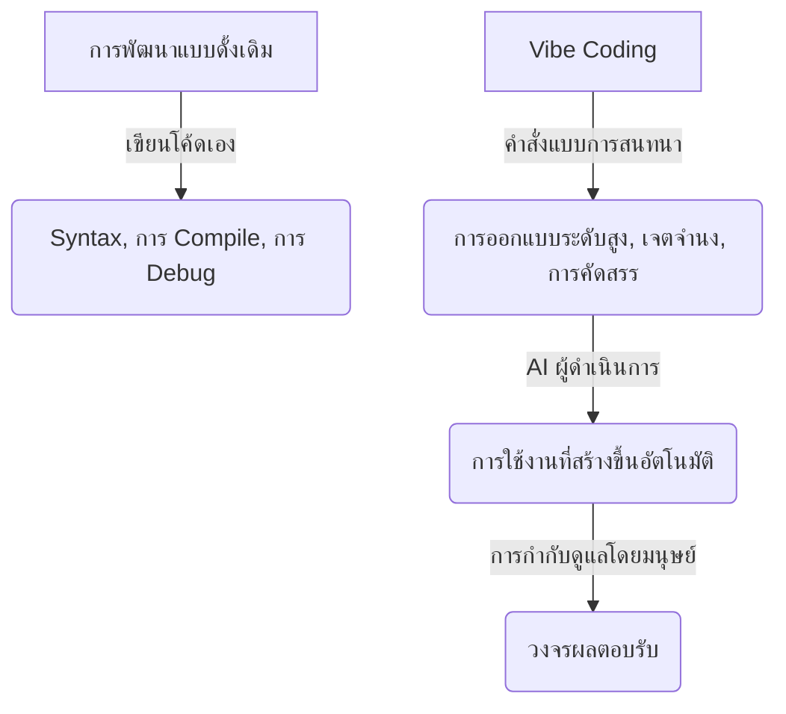
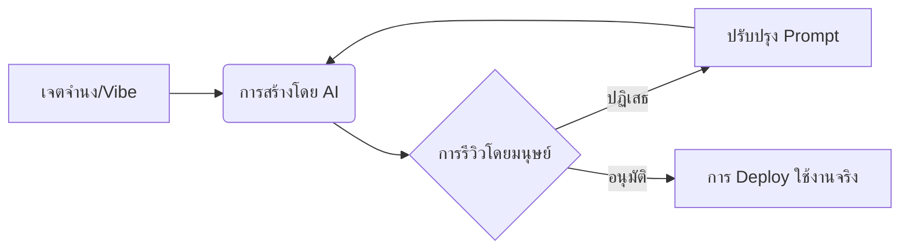
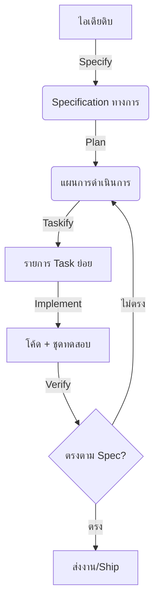

# การพัฒนาเว็บแอปพลิเคชันด้วย "Vibe Coding"

"Vibe Coding" คือการเปลี่ยนแปลงกระบวนทัศน์สมัยใหม่ในด้านวิศวกรรมซอฟต์แวร์และการพัฒนาเว็บแอปพลิเคชัน คำนี้ถูกบัญญัติขึ้นในช่วงต้นปี 2025 โดยสื่อถึงแนวทางการสร้างซอฟต์แวร์ที่ขับเคลื่อนด้วยการสนทนาและการใช้ Prompt (คำสั่ง) ซึ่งมนุษย์เป็นผู้กำหนดไอเดียในระดับสูง และ AI เป็นผู้ดำเนินการเขียนโค้ดทีละบรรทัด

---

## 🚀 1. "Vibe Coding" คืออะไร?

**Vibe Coding** หมายถึง Workflow การพัฒนาซอฟต์แวร์ที่นักพัฒนาเปลี่ยนบทบาทจากการเป็นคนเขียนโค้ดทีละบรรทัด ไปเป็น Creative Director (ผู้อำนวยการฝ่ายสร้างสรรค์) หรือ Software Architect (สถาปนิกซอฟต์แวร์)

แทนที่จะเขียนโค้ดด้วยตัวเอง นักพัฒนาจะ:

1. อธิบายระบบ คุณลักษณะ หรือการออกแบบที่ต้องการด้วย **ภาษาธรรมชาติ (Natural Language)**
2. แนะนำ AI Agent หรือ Code Assistant ที่ทำงานได้ด้วยตนเองเพื่อสร้างไฟล์, Script และโครงสร้างต่างๆ
3. ทดสอบ ปรับแต่ง และทำซ้ำในวงจรของผลตอบรับและการปรับเปลี่ยน

ดังที่ **Andrej Karpathy** นักวิจัยด้าน AI และผู้ร่วมก่อตั้ง OpenAI ได้กล่าวไว้ว่า:

> *"ปล่อยใจไปตาม Vibes (ความรู้สึก), ยอมรับการเติบโตแบบทวีคูณ และลืมไปเลยว่าโค้ดนั้นมีตัวตนอยู่"*

### การเปลี่ยนแนวคิดเชิงโครงสร้าง

---

## 🛠️ 2. หลักการพื้นฐานและ Workflow

Vibe Coding ไม่ใช่แค่การพิมพ์ Prompt เพียงครั้งเดียว แต่มันคือการสนทนาที่ต้องทำซ้ำและโต้ตอบกับ AI วงจรชีวิตมาตรฐานของเว็บแอปพลิเคชันที่สร้างผ่าน Vibe Coding จะดำเนินตามลูปนี้:

### 1. การสร้างแนวคิดและการใช้ Prompt เชิงสถาปัตยกรรม (Architectural Prompting)

นักพัฒนาจะกำหนด Tech Stack, แนวทางการออกแบบภาพ และข้อกำหนดด้านฟังก์ชัน แทนที่จะขอโค้ดทันที พวกเขาจะใช้ Prompt ให้ AI วางแผนการทำงานของแอปพลิเคชันก่อน

### 2. การสร้างแบบวนซ้ำ ("ดูของ, พูดคุย, รันงาน")

* **ดูของ (See Stuff):** รันโค้ดและตรวจสอบผลลัพธ์ผ่านหน้าจอหรือผ่านโปรแกรม
* **พูดคุย (Say Stuff):** บอก AI ว่าอะไรเสีย อะไรที่ต้องเปลี่ยน หรือฟีเจอร์ไหนที่ต้องเพิ่มต่อไป
* **รันงาน (Run Stuff):** ดำเนินการรัน Codebase ที่ถูก Refactor หรือขยายส่วนงานใหม่ทันที

### 3. แนวคิดแบบ "Tech Lead"

ใน Vibe Coding มนุษย์จะรับบทบาทเป็น **Tech Lead** หรือ **Product Manager** และ AI จะทำหน้าที่เป็น **Junior Engineer** ที่มีความสามารถสูงแต่ทำงานตามคำสั่งอย่างเคร่งครัด

---

## 🧰 3. เครื่องมือยอดนิยมในระบบนิเวศ Vibe Coding

เครื่องมือพัฒนารูปแบบ "AI-first" ได้เกิดขึ้นเพื่อสนับสนุน Workflow นี้:

| เครื่องมือ | ขอบเขตการทำงาน | จุดแข็ง |
| :--- | :--- | :--- |
| **Cursor** | Code Editor ที่เน้น AI | การทำ Indexing ของ Codebase ที่ราบรื่น, การแก้ไขโค้ดแบบ In-line, การแก้ไขหลายไฟล์พร้อมกัน และ Chat ที่เข้าใจบริบท |
| **Replit Agent** | การสร้างต้นแบบ Full-Stack อย่างรวดเร็ว | การสร้างแอปพลิเคชันจากการสนทนาตั้งแต่ไอเดียไปจนถึงการ Deploy ทันที พร้อมตั้งค่าฐานข้อมูลและ Backend อัตโนมัติ |
| **Github Copilot Workspace** | Agent ที่ทำงานตาม Task | สร้างแผนงานหลายไฟล์จาก Issue และดำเนินการผ่าน Interface รูปแบบ Pull-Request |
| **Agy & AI Studio** | การคิดเชิงสร้างสรรค์ / Multimodal | ความสามารถของ Context Window ที่ยอดเยี่ยมสำหรับการวิเคราะห์ Codebase ขนาดใหญ่ทั้งหมดหรือ Asset ต่างๆ เพื่อเสนอแนะฟีเจอร์ |

---

## ⚖️ 4. ข้อดีและข้อเสียของแนวทาง "Vibe"

แม้ว่า Vibe Coding จะทำให้การสร้างแอปพลิเคชันรวดเร็วอย่างเหลือเชื่อ แต่มันก็ยังเป็นหัวข้อที่มีการถกเถียงกันอย่างกว้างขวางในชุมชนนักพัฒนา

### ข้อดี

* ⚡ **ความเร็วสูงสุด:** สร้างต้นแบบที่ใช้งานได้, MVP (Minimum Viable Products) และเครื่องมือภายในในเวลาเพียงไม่กี่นาทีหรือชั่วโมง แทนที่จะเป็นวันหรือสัปดาห์
* 🔓 **การทำให้ซอฟต์แวร์เข้าถึงได้ทุกคน (Democratization):** ลดกำแพงในการเรียนรู้ ช่วยให้ Designer, Product Manager และผู้ที่ไม่ใช่นักเขียนโปรแกรมสามารถสร้างเว็บแอปพลิเคชันจริงๆ ได้
* 🧠 **ลดภาระทางสมอง (Cognitive Load):** ช่วยทำงานซ้ำซากประเภท Boilerplate, ขั้นตอนการตั้งค่า Configuration และการจัดการสภาพแวดล้อม ช่วยให้นักพัฒนาโฟกัสไปที่ตัวผลิตภัณฑ์และการออกแบบ UX ได้อย่างเต็มที่

### ความเสี่ยงและความท้าทาย

* ⚠️ **คุณภาพโค้ดและหนี้ทางเทคนิค (Technical Debt):** โค้ดที่สร้างโดย AI บางครั้งอาจเป็น "Black Box" ซึ่งมีฟังก์ชันที่ซ้ำซ้อน, Algorithm ที่ไม่มีประสิทธิภาพ หรือรูปแบบที่ล้าสมัย
* 🔒 **ช่องโหว่ด้านความปลอดภัย:** LLM อาจนำเข้า Dependency ที่ไม่ปลอดภัย, ละเลยการตรวจสอบความถูกต้องของ Input หรือทำ API Secret รั่วไหลหากไม่มีการแนะนำอย่างระมัดระวัง
* 📉 **ทักษะเสื่อมถอย (Skill Atrophy):** การพึ่งพา AI เพียงอย่างเดียวอาจทำให้ความเข้าใจพื้นฐานของนักพัฒนาเกี่ยวกับ Syntax ของภาษา, Algorithm และหลักการพื้นฐานของวิทยาการคอมพิวเตอร์ลดลงตามกาลเวลา

---

## 📚 5. แนวทางปฏิบัติที่ดีที่สุดสำหรับ Vibe Coding คุณภาพสูง

เพื่อเปลี่ยนจากการเป็นนัก Vibe Coding มือสมัครเล่น ไปสู่ **วิศวกรรมซอฟต์แวร์ที่ใช้ AI ช่วยในระดับการผลิต (Production-grade)** นักพัฒนาควรปฏิบัติตามแนวทางเหล่านี้:

### 1. เชี่ยวชาญด้านบริบท (Context) และขอบเขต (Scope)

* **ให้ข้อมูลพื้นฐานกับ AI:** ระบุไฟล์ที่แน่นอน, Schema ของฐานข้อมูล และเอกสารประกอบ อย่าปล่อยให้ AI เดาหรือเกิดอาการ Hallucinate (หลอน)
* **แบ่งงานให้เล็กลง:** อย่าขอเว็บไซต์ทั้งหมดใน Prompt เดียว ให้แบ่งการพัฒนาออกเป็น Micro-features ที่เพิ่มขึ้นทีละส่วน (เช่น สร้าง Schema ฐานข้อมูลก่อน จากนั้นจึงสร้างระบบยืนยันตัวตน แล้วค่อยสร้าง UI ของ Dashboard)

### 2. ให้ความสำคัญกับการตรวจสอบและการทดสอบ

* **ทดสอบทันที:** สร้าง Unit Test หรือ Functional Test ตั้งแต่เนิ่นๆ ใช้ AI เพื่อสร้าง Test ในการตรวจสอบ Logic ของตัวมันเอง
* **ตรวจสอบโค้ดที่สร้างขึ้น:** อย่ารับงานเขียนโค้ดขนาดใหญ่โดยไม่ตรวจสอบ ให้ทำการรีวิวแบบ Diff และตรวจสอบรูปแบบสถาปัตยกรรมเสมอ

### 3. รักษาความลับและความปลอดภัยของสภาพแวดล้อม

* ห้ามวาง API Key, Private Token หรือข้อมูลผู้ใช้ลงใน Prompt
* บังคับใช้ไฟล์ `.env` เสมอ และตรวจสอบให้แน่ใจว่าได้เพิ่มลงใน `.gitignore` แล้ว

### 4. ใส่ "รสนิยม" และความสวยงามในการออกแบบของคุณ

* แม้ว่า AI จะเขียน Logic การทำงานได้ แต่ "รสนิยม" ของมนุษย์จะเป็นตัวกำหนดว่าแอปนั้นน่าใช้งานหรือไม่ ให้ใส่ใจเป็นพิเศษกับ Typography สมัยใหม่, Micro-animations ที่ซ่อนอยู่, Palette สีที่คัดสรรมาอย่างดี และการออกแบบที่รองรับทุกอุปกรณ์ (Responsive Design)

---

## ⚖️ 6. Vibe Coding vs. Low-Code/No-Code: ความแตกต่างใหม่

แม้ว่าทั้งคู่จะมีเป้าหมายเพื่อช่วยให้การสร้างแอปเข้าถึงได้ง่ายขึ้น แต่ Vibe Coding และ Low-Code/No-Code (LCNC) มีปรัชญาที่แตกต่างกันอย่างสิ้นเชิง

| คุณสมบัติ | Vibe Coding | Low-Code / No-Code |
| :--- | :--- | :--- |
| **Interface หลัก** | ภาษาธรรมชาติ (Chat/Prompts) | การมองเห็น (Drag-and-drop, เมนู) |
| **ผลลัพธ์** | **ซอร์สโค้ดจริง** (React, Python ฯลฯ) | **Metadata เฉพาะตัว** (ติดอยู่กับ Platform) |
| **ความยืดหยุ่น** | **ไร้ขีดจำกัด** ทำได้ทุกอย่างที่โค้ดทำได้ | **จำกัด** อยู่ที่ Component ที่เตรียมไว้ให้ |
| **การผูกขาดกับผู้ให้บริการ** | **ต่ำ** คุณเป็นเจ้าของและโฮสต์โค้ดได้ทุกที่ | **สูง** การย้ายออกต้องเริ่มสร้างใหม่ทั้งหมด |
| **การกำกับดูแล** | **ตรวจสอบด้วยคน** ต้องมีการดูแลโดยมนุษย์ | **มีมาในตัว** ความปลอดภัยระดับองค์กร |

---

## 🎨 7. องค์ประกอบของมนุษย์: "รสนิยม" คือ Compiler ตัวใหม่

ในยุคของ Vibe Coding บทบาทหลักของนักพัฒนาจะเปลี่ยนจาก **การลงมือทำ (Implementation)** (การเขียน Syntax) ไปเป็นการ **คัดสรร (Curation)** (การประเมินผลลัพธ์) เมื่อ AI รับหน้าที่จัดการเรื่อง "อย่างไร" รสนิยมของมนุษย์จะกลายเป็นเรื่องหลักว่า "คืออะไร"

### รสนิยมในฐานะโซลูชัน "กิโลเมตรสุดท้าย" (Last Mile)

AI นั้นยอดเยี่ยมในการสร้างต้นแบบที่ใช้งานได้ 80-90% แรก อย่างไรก็ตาม รสนิยมของมนุษย์เป็นสิ่งจำเป็นสำหรับ 10% สุดท้าย ไม่ว่าจะเป็นการเว้นวรรคที่แม่นยำ, "จิตวิญญาณ" ของแบรนด์ และ Micro-interactions ที่ใช้งานง่ายซึ่งทำให้ผลิตภัณฑ์รู้สึกพรีเมียม

---

## 📈 8. อนาคตของตลาดงานซอฟต์แวร์

Vibe Coding กำลังเปลี่ยนเส้นทางอาชีพของนักพัฒนา โดยทำให้บทบาทระดับกลางหายไปและเกิดการเปลี่ยนแปลงครั้งใหญ่ในด้านความอาวุโส (Seniority)

* **การเบียดเสียดของระดับ Junior:** บทบาทเริ่มต้นที่เน้นงาน Boilerplate และ Unit Test กำลังถูกคุกคาม เนื่องจาก AI สามารถจัดการงานเหล่านี้ได้ทันที
* **ค่าพรีเมียมของระดับ Senior:** มูลค่าของวิศวกรอาวุโสได้เปลี่ยนจากความคล่องแคล่วด้าน Syntax ไปเป็นการ **ตัดสินใจเชิงสถาปัตยกรรม** ปัจจุบัน Senior คือ "AI Operators" ผู้ดูแลความปลอดภัย การขยายตัวของระบบ และความสมบูรณ์ของระบบ

### การเปลี่ยนแปลงในทักษะหลัก

| ประเภททักษะ | ยุคดั้งเดิม | ยุค Vibe Coding |
| :--- | :--- | :--- |
| **ทักษะหลัก** | ความเชี่ยวชาญ Syntax และภาษา | การออกแบบระบบและการกำหนดเจตจำนง |
| **บทบาทในการพัฒนา** | ผู้ลงมือทำหลัก | ผู้อำนวยการสถาปัตยกรรม / AI Operator |
| **ความเสี่ยงสำคัญ** | เข้าสู่ตลาดช้า | หนี้ทางเทคนิคสูง / "Slop" (งานขยะ) |

---

## 🛡️ 9. การจัดการ "Vibe Debt" และ Technical Slop

ความเสี่ยงที่ใหญ่ที่สุดของการสร้างงานด้วย AI อย่างรวดเร็วคือ **Vibe Debt** — การสะสมของโค้ดที่ไม่ได้รีวิว ซ้ำซ้อน หรือไม่ปลอดภัย ซึ่งกลายเป็น "Black Box" เมื่อเวลาผ่านไป

### กลยุทธ์เพื่อคุณภาพระดับ Production

1. **หลีกเลี่ยงปัจจัย "Slop":** อย่ารับการสร้างโค้ดขนาดใหญ่โดยไม่มีการรีวิวแบบ Diff ให้ถือว่าผลลัพธ์จาก AI คือ "Pull Request" จากเด็กฝึกงาน Junior
2. **การเกิดขึ้นของ "Cleanup Engineers":** นักพัฒนากลุ่มใหม่ที่มุ่งเน้นการ Refactor และสร้างความปลอดภัยให้กับต้นแบบที่ถูก Vibe Code มา เพื่อให้เป็นระบบที่ขยายขนาดได้
3. **การตรวจสอบระดับ Micro (Micro-Verification):** ใช้ AI เพื่อสร้าง Unit Test *ก่อน* ที่มันจะสร้าง Code การทำงานจริง เพื่อให้แน่ใจว่าฟังก์ชันมีความถูกต้องตั้งแต่เริ่มต้น
4. **รักษาความสามารถในการ "อ่านโค้ด":** แม้ว่าคุณอาจจะไม่ได้เขียนเองทุกบรรทัด แต่คุณต้องสามารถอ่านและเข้าใจโค้ดเพื่อ Debug กรณีที่ AI พลาดไปได้

---

## 🛠️ 10. Spec-Driven Development (SDD): ก้าวข้ามแค่เรื่อง Vibe

เมื่อโปรเจกต์ Vibe Coding ขยายขนาดขึ้น มักจะพบกับ **"กำแพงสามเดือน"** — จุดที่การ Prompt แบบหลวมๆ นำไปสู่ความซับซ้อนที่จัดการไม่ได้และวงจรการถดถอย (Regression) **Spec-Driven Development (SDD)** คือวิวัฒนาการระดับมืออาชีพของ Vibe โดยเปลี่ยนจุดเน้นจากการ "Vibing" กับโค้ด ไปเป็นการจัดการ **เจตจำนง (Intent)**

### วงจรชีวิต SDD: สี่เสาหลัก

SDD ปฏิบัติต่อ AI เหมือนเป็น "คู่หูเขียนโปรแกรมที่คิดตามตัวอักษร" ซึ่งต้องการขอบเขตที่ชัดเจน Workflow จะแบ่งออกเป็นระยะต่างๆ ดังนี้:

1. **กำหนดรายละเอียด (Specify - `/specify`):**
    * **การดำเนินการ**: อธิบาย "อะไร" และ "ทำไม" ด้วยภาษาธรรมชาติ
    * **ผลลัพธ์**: เอกสาร Specification ในรูปแบบ Markdown ที่ครอบคลุมข้อกำหนดด้านฟังก์ชัน, User Flows และ Edge Cases
    * **เป้าหมาย**: ปรับจูนเจตจำนงให้ตรงกัน *ก่อน* ลงมือทำ
2. **วางแผน (Plan - `/plan`):**
    * **การดำเนินการ**: กำหนดข้อจำกัดทางเทคนิค (Tech Stack, สถาปัตยกรรม, มาตรฐาน)
    * **ผลลัพธ์**: แผนการดำเนินการทางเทคนิคที่จับคู่ Spec เข้ากับ Codebase เดิม
    * **เป้าหมาย**: กำหนด "อย่างไร" และรับประกันความสม่ำเสมอของสถาปัตยกรรม
3. **แบ่งงาน (Tasks - `/tasks`):**
    * **การดำเนินการ**: แบ่งแผนงานออกเป็นหน่วยย่อยๆ ที่เป็นอิสระต่อกันและสามารถรีวิวได้
    * **ผลลัพธ์**: Checklist ของขั้นตอนการดำเนินการที่แยกจากกัน
    * **เป้าหมาย**: ช่วยให้เกิดความก้าวหน้าทีละส่วนและตรวจสอบได้ตั้งแต่เนิ่นๆ
4. **ลงมือทำ (Implement):**
    * **การดำเนินการ**: AI Agent ดำเนินการตาม Task ทีละอย่าง
    * **ผลลัพธ์**: โค้ดและชุดการทดสอบประกอบ
    * **เป้าหมาย**: การดำเนินการที่ตรวจสอบได้และอยู่ในระดับที่พร้อมใช้งานจริง (Production-grade)

### Pipeline ของ SDD

### ระดับความพร้อมของ SDD สามระดับ

ทีมงานมักจะปรับใช้ SDD ในระดับหนึ่งจากสามระดับนี้:

* **ระดับ 1: Spec-First**: คุณเขียน Spec เพื่อขับเคลื่อนฟีเจอร์ที่ซับซ้อนโดยเฉพาะ เมื่อส่งงานแล้ว Spec จะถูกเก็บเข้ากรุ
* **ระดับ 2: Spec-Anchored**: Spec ถูกควบคุมด้วย Version Control และปรับปรุงอยู่เสมอ การเปลี่ยนแปลงในอนาคตต้องเริ่มจากการอัปเดต Spec ก่อนเพื่อป้องกัน "ความเพี้ยนทางสถาปัตยกรรม (Architectural Drift)"
* **ระดับ 3: Spec-as-Source**: Spec คือผลงานหลัก มนุษย์จะแก้ไขเฉพาะเอกสาร Specification เท่านั้น และ AI จะ "Compile" มันออกมาเป็นโค้ด

### การเปรียบเทียบ: Vibe Coding vs. SDD

| คุณสมบัติ | Vibe Coding | Spec-Driven Development (SDD) |
| :--- | :--- | :--- |
| **เป้าหมายหลัก** | ความเร็วและการค้นพบ | ความน่าเชื่อถือและความเสถียรระยะยาว |
| **แหล่งข้อมูลความจริง** | ประวัติ Chat / Prompt ชั่วคราว | Specification ที่มีการคุมเวอร์ชัน (PRD) |
| **บทบาทนักพัฒนา** | Prompt Engineer / ผู้ทดสอบ | Architect / ผู้จัดการเจตจำนง |
| **มาตรวัดความสำเร็จ** | "มันทำงานได้ในตอนนี้" | "มันตรงตาม Spec และบำรุงรักษาได้" |
| **เหมาะสำหรับ** | MVP, ต้นแบบ, การสำรวจ | ระบบจริง, การทำงานเป็นทีม, งานสเกลใหญ่ |

---

## 🛠️ 11. Stack นักพัฒนารูปแบบ AI-Native (ฉบับปี 2026)

ภายในปี 2026 ระบบนิเวศ Vibe Coding ได้พัฒนาไปสู่ Stack ที่แบ่งเป็นหลายชั้น ซึ่งแยกส่วนของ **การสร้างไอเดีย (Ideation)**, **การจัดแจง (Orchestration)** และ **การดำเนินการ (Execution)**

| ชั้น (Layer) | ส่วนประกอบ | มาตรฐานปี 2026 |
| :--- | :--- | :--- |
| **Orchestration** | **มันสมอง (The Brain)** | เครื่องมือที่จัดการสถานะ, บริบท และการวางแผนข้ามไฟล์ |
| **Execution** | **มือ (The Hands)** | **Sub-Agents** เฉพาะทาง (เช่น ผู้ตรวจสอบ Codebase, ผู้เชี่ยวชาญ Firebase) ที่ทำงานย่อยๆ |
| **Persistence** | **ความจำ (The Memory)** | เอกสารที่ยึดตามบริบท (PRD, Spec) ที่ทำหน้าที่เป็นความจำระยะยาวของโปรเจกต์ |
| **Verification** | **ผู้ตรวจสอบ (The Auditor)** | "Slop Detectors" อัตโนมัติที่รันการ Lint และตรวจสอบความปลอดภัยในทุกการสร้างของ AI |

## 🤖 12. จาก 'การแชท' สู่ 'การจัดแจง (Orchestration)'

ยุคของ "การวางโค้ดลงในหน้าต่างแชท" ได้สิ้นสุดลงแล้ว Vibe Coding สมัยใหม่ในปี 2026 พึ่งพา **Context-Aware Orchestration**

* **การพัฒนาแบบให้ความสำคัญกับบริบท (Context-First):** แทนที่จะอธิบายโปรเจกต์ของคุณให้ AI ฟัง คุณจะใช้เครื่องมือที่ทำ Index ข้อมูลทั้งสภาพแวดล้อมของคุณ, เอกสารในเครื่อง และ API Key อย่างปลอดภัยอยู่แล้ว
* **"Agent-in-the-Loop":** นักพัฒนาไม่ต้องใช้ Prompt เพื่อขอโค้ดอีกต่อไป แต่จะมอบหมายงานให้ **Sub-Agents** คุณอาจจะพูดว่า: *"Sub-agent `firebase-expert`, ช่วยทำระบบ Auth ตามไฟล์ `vibetree_prd.md` ที"* จากนั้นจึงรีวิวผลลัพธ์
* **Zero-Shot Scaffolding:** การเริ่มโปรเจกต์ใช้เวลาเพียงไม่กี่วินาที เนื่องจาก Agent จะกำหนดค่า Cloud Backend (Firebase/App Hosting), CI/CD Pipeline และสภาพแวดล้อมในเครื่องให้โดยอัตโนมัติตาม "Vibe" ของคุณ

---

## 🎯 บทสรุป: วิศวกร AI-Native ที่สมบูรณ์แบบ

**Vibe Coding มีไว้เพื่อหาทางออก; SDD มีไว้เพื่อสร้างผลิตภัณฑ์** ในปี 2026 นักพัฒนาที่ประสบความสำเร็จที่สุดคือผู้ที่สามารถ "Vibe" อย่างสร้างสรรค์ในขณะที่ยังคงรักษาวินัยทางสถาปัตยกรรมของ Spec-Driven Development ไว้ได้ ด้วยการเชี่ยวชาญด้านบริบท รสนิยม และการจัดแจง Agent คุณจะไม่ได้แค่เขียนโค้ด แต่คุณกำลังสร้างสรรค์ประสบการณ์จริงขึ้นมา
