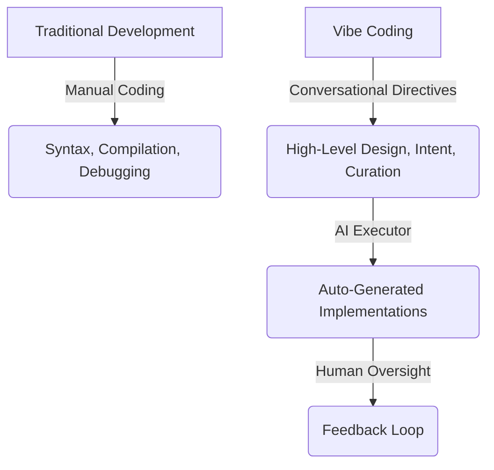

# Web Application Development with "Vibe Coding"

"Vibe Coding" is a modern paradigm shift in software engineering and web application development. Coined in early 2025, the term captures a conversational, prompt-driven approach to creating software where humans direct high-level ideas, and AI executes the line-by-line implementation.

---

## 🚀 1. What is "Vibe Coding"?

**Vibe Coding** represents a software development workflow where the developer shifts from being a line-by-line coder to a creative director or software architect. 

Instead of writing code manually, the developer:
1. Describes the intended system, features, or design in **natural language**.
2. Guides autonomous AI agents or code assistants to generate the files, scripts, and structures.
3. Tests, refines, and iterates in a loop of feedback and adjustment.

As AI researcher and OpenAI co-founder **Andrej Karpathy** put it:
> *"Fully give in to the vibes, embrace exponentials, and forget that the code even exists."*

### The Conceptual Shift

---

## 🛠️ 2. Core Principles & Workflow

Vibe coding is not just about typing a single prompt; it is an iterative, conversational dialogue with AI. The standard lifecycle of a web application built via vibe coding follows this loop:

### 1. Conceptualization & Architectural Prompting
The developer establishes the stack, visual guidelines, and functional requirements. Instead of asking for code immediately, they prompt the AI to plan the application.

### 2. Iterative Generation ("See Stuff, Say Stuff, Run Stuff")
* **See Stuff:** Run the code and visually or programmatically inspect the output.
* **Say Stuff:** Tell the AI what is broken, what to change, or what feature to add next.
* **Run Stuff:** Execute the newly refactored or expanded codebase.

### 3. The "Tech Lead" Mindset
In vibe coding, the human takes on the role of a **Tech Lead** or **Product Manager**, and the AI acts as a highly capable but literal **Junior Engineer**.

---

## 🧰 3. Popular Tools in the Vibe Coding Ecosystem

A class of "AI-first" developer tools has emerged to power this workflow:

| Tool | Focus Area | Strengths |
| :--- | :--- | :--- |
| **Cursor** | AI-first Code Editor | Seamless code base indexing, in-line code edits, multi-file edits, and context-aware chat. |
| **Replit Agent** | Full-Stack Rapid Prototyping | Conversational application creation from idea to instant deployment, setup of database and backend automatically. |
| **Github Copilot Workspace** | Task-Based Agents | Generates multi-file plans from issues and implements them directly in a pull-request style interface. |
| **Google Gemini & AI Studio** | Creative/Multimodal Ideation | Excellent context-window capacity for analyzing entire large codebases or assets to suggest features. |

---

## ⚖️ 4. Pros & Cons of the "Vibe" Approach

While vibe coding has made app creation incredibly fast, it is a subject of active debate in the software development community.

### Advantages
* ⚡ **Extreme Velocity:** Build functional prototypes, MVPs (Minimum Viable Products), and internal utilities in minutes or hours instead of days or weeks.
* 🔓 **Democratization of Software:** Lowers the entry barrier, allowing designers, product managers, and non-programmers to build real web applications.
* 🧠 **Reduced Cognitive Load:** Automates repetitive boilerplates, configuration steps, and environment setups, allowing developers to focus purely on product and UX design.

### Risks and Challenges
* ⚠️ **Code Quality & Technical Debt:** AI-generated code can sometimes be a "black box," containing redundant functions, inefficient algorithms, or outdated paradigms.
* 🔒 **Security Vulnerabilities:** LLMs can easily introduce insecure dependencies, ignore input validation, or leak sensitive API secrets if not guided carefully.
* 📉 **Skill Atrophy:** Relying purely on AI can weaken a developer's foundational understanding of language syntax, algorithms, and fundamental computer science principles over time.

---

## 📚 5. Best Practices for High-Quality Vibe Coding

To transition from "pure" hobbyist vibe coding to **production-grade AI-assisted software engineering**, developers should follow these practices:

### 1. Master Context and Scope
* **Ground the AI:** Provide precise files, database schemas, and documentation. Don't let the AI guess or hallucinate.
* **Break It Down:** Never ask for a complete website in one prompt. Split development into incremental, micro-features (e.g., first build the database schema, then user authentication, then the dashboard UI).

### 2. Prioritize Verification and Testing
* **Test Immediately:** Build unit tests or functional tests early. Use the AI to generate tests to verify its own logic.
* **Review Generated Code:** Never blindly accept large code generation. Do diff reviews and inspect the architectural patterns.

### 3. Maintain Secret and Environment Security
* Never paste API keys, private tokens, or user data into prompts.
* Always enforce the use of `.env` files and ensure they are added to `.gitignore`.

### 4. Inject Your "Taste" and Design Aesthetics
* While AI can write functional logic, human "taste" dictates whether an app is delightful to use. Pay special attention to modern typography, subtle micro-animations, curated color palettes, and responsive design.
